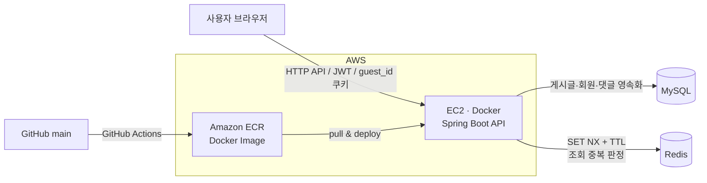
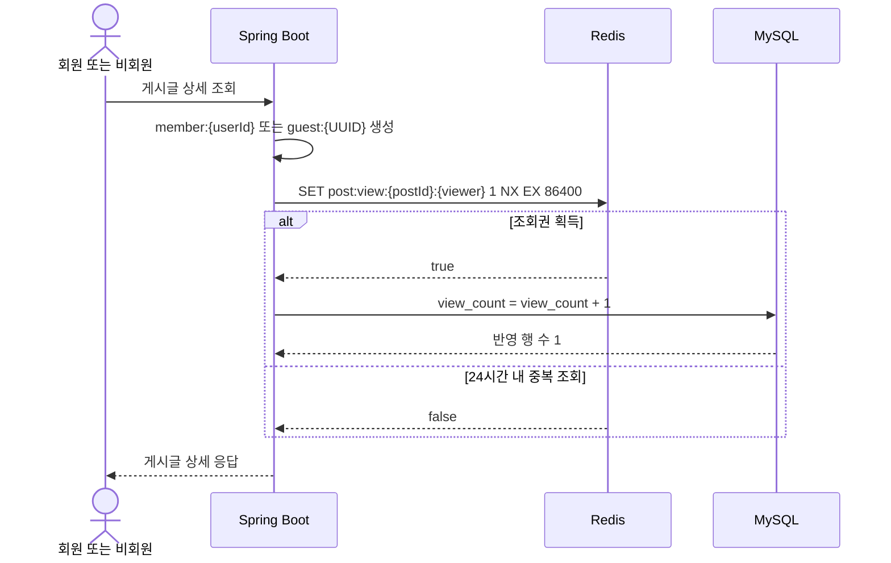
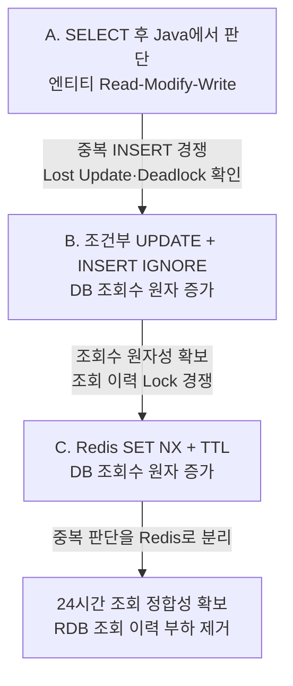

# [버그도감]

> 개발 중 마주친 버그와 해결 방법을 기록하고 공유하는 커뮤니티 서비스입니다.

## 프로젝트 영상


## 프로젝트 정보
| 항목 | 내용 |
| --- | --- |
| 개발 인원 | 프론트엔드 + 백엔드 1명(본인) |
| 개발 기간 | 2026.05.26 ~ 2026.08.09 |
| Backend GitHub | [백엔드 저장소](https://github.com/100-hours-a-week/KTB4_Soo_Week4) |
| Frontend GitHub | [프런트엔드 저장소](https://github.com/100-hours-a-week/KTB4_Soo_Week7) |
| 서비스 시연 영상 | [영상 보기](SERVICE_VIDEO_URL) |

## 주요 기능

- JWT 기반 회원가입·로그인 및 회원 정보 수정·탈퇴
- 게시글 작성, 수정, 소프트 삭제
- 게시글 좋아요 및 목록·상세 조회
- 원댓글·대댓글 작성, 수정, 삭제
- 회원 ID와 비회원 UUID 쿠키를 이용한 조회자 식별
- Redis 기반 24시간 중복 조회 방지와 원자적 조회수 증가

## 기술 스택 및 도구

| 구분 | 기술 |
| --- | --- |
| Language | Java 21 |
| Framework | Spring Boot 4.0.6, Spring MVC, Spring Security |
| Persistence | Spring Data JPA, Hibernate, MySQL |
| Cache | Redis (`SET NX + TTL`) |
| Authentication | JWT (JJWT) |
| Test | JUnit 5, Spring Boot Test, H2, k6, JaCoCo |
| Infra | AWS EC2, Amazon ECR, Docker |
| CI/CD | GitHub Actions |
| Build | Gradle |
| Tools | IntelliJ IDEA, Postman, MySQL Workbench, Redis CLI |

## 시스템 아키텍처



Redis는 조회 여부만 24시간 동안 보관하고, 실제 게시글 조회수는 MySQL을 최종 저장소로 사용합니다.

## 조회수 처리 흐름



- 회원은 인증된 `userId`, 비회원은 서버가 발급한 `guest_id` UUID 쿠키로 식별합니다.
- Redis 키는 `post:view:{postId}:member:{userId}` 또는 `post:view:{postId}:guest:{guestId}` 형식이며 TTL은 24시간입니다.
- 조회권을 얻은 요청만 `view_count = view_count + 1` 쿼리를 실행합니다.
- DB 증가가 실패하면 선점한 Redis 키를 삭제해 다음 요청이 재시도할 수 있도록 보상합니다.
- Redis 연결 실패 시에는 중복 증가보다 정합성을 우선하여 조회수를 증가시키지 않는 Fail Closed 정책을 적용했습니다.

## 주요 기술적 개선

### 1. 조회수 정합성: 애플리케이션 처리에서 Redis까지

조회수 기능을 한 번에 Redis로 교체하지 않고, 동시성 문제를 재현하고 원인을 확인하며 단계적으로 개선했습니다.

| 방식 | 중복 조회 판단 | 조회수 증가 | 확인된 결과 |
| --- | --- | --- | --- |
| A. 애플리케이션 | `SELECT → Java 판단 → INSERT/UPDATE` | 엔티티 `+1` 후 Dirty Checking | Check-Then-Act 경쟁, Lost Update 가능성, FK Lock 전환 데드락 |
| B. DB 원자 연산 | 조건부 `UPDATE → INSERT IGNORE` | `view_count = view_count + 1` | Lost Update 방지. 단, 존재하지 않는 이력의 Gap/Next-Key Lock과 INSERT가 충돌해 데드락 발생 |
| C. Redis | `SET NX + TTL` | `view_count = view_count + 1` | 조회 이력 경쟁을 DB 앞에서 차단하고 중복 요청을 정상 응답으로 처리 |



#### A. 애플리케이션 방식

조회 이력을 읽고 Java에서 24시간 경과 여부를 판단한 뒤 저장했습니다. 여러 요청이 같은 상태를 동시에 읽을 수 있어, 동일 조회자의 최초 조회에서는 중복 `INSERT` 경쟁이 발생했습니다. 서로 다른 조회자도 `post_views`의 외래 키 검증 과정에서 같은 게시글에 Shared Lock을 보유한 뒤 조회수 갱신을 위한 Exclusive Lock으로 전환하면서 데드락이 발생했습니다. 엔티티 값을 읽어 `+1` 하는 방식은 Lost Update 가능성도 가지고 있었습니다.

#### B. DB 원자적 방식

조회수는 다음과 같은 단일 쿼리로 변경하여 여러 요청이 동시에 실행돼도 증가분이 유실되지 않게 했습니다.

```sql
UPDATE posts
SET view_count = view_count + 1
WHERE id = :postId;
```

조회 이력도 조건부 `UPDATE`와 `INSERT IGNORE`의 반영 행 수로 조회권 획득 여부를 판단했습니다. Java의 Check-Then-Act는 제거했지만, 최초 조회처럼 갱신 대상이 없는 경우 `UPDATE`가 인덱스 범위 Lock을 잡은 상태에서 여러 트랜잭션이 `INSERT`를 시도해 데드락이 남는 것을 InnoDB 로그로 확인했습니다.

#### C. Redis 방식

조회 이력을 RDB에 먼저 쓰지 않고 Redis `SET NX + TTL`로 분리했습니다. 동일 키에는 한 요청만 성공하므로 조회권을 얻은 요청만 MySQL 조회수를 원자적으로 증가시킵니다. 중복 요청은 오류가 아니라 정상 상세 응답으로 처리됩니다.

### 2. 게시글 목록 조회 N+1 개선

- 게시글과 작성자를 Fetch Join으로 조회했습니다.
- 게시글별 좋아요·댓글 수를 반복 조회하지 않고 `GROUP BY ... IN (:postIds)` 집계 쿼리로 한 번에 조회했습니다.
- 집계 결과를 `Map<postId, count>`로 변환해 응답을 조립하여 게시글 수에 비례하던 쿼리를 고정된 수로 줄였습니다.

### 3. 비회원 조회자 식별

- 유효한 `guest_id` 쿠키가 없으면 서버가 UUID를 발급합니다.
- 쿠키는 `HttpOnly`, `SameSite=Lax`, `Path=/`, 유효기간 1년으로 설정합니다.
- 운영 HTTPS 요청에서는 `Secure`를 적용하고, 로컬 HTTP 환경에서도 테스트할 수 있도록 요청 환경에 따라 값을 결정합니다.

### 4. 배포 자동화

`main` 브랜치에 코드가 반영되면 GitHub Actions가 Docker 이미지를 빌드해 Amazon ECR에 업로드합니다. 이후 EC2에 SSH로 접속해 최신 이미지를 가져오고 Docker Compose로 백엔드 컨테이너를 재배포합니다.

## 조회수 정합성 테스트

### 테스트 도구와 검증 기준

k6의 `per-vu-iterations` 시나리오를 사용해 각 가상 사용자가 같은 시점에 한 번씩 요청하도록 구성했습니다. HTTP 성공률만으로 정합성을 판단하지 않고 다음 항목을 함께 확인했습니다.

- k6의 `http_req_failed`, 상태 코드, 요청 수
- 테스트 전후 `posts.view_count` 차이
- `post_views` 이력 수 또는 Redis 키 수와 TTL
- 애플리케이션 예외와 MySQL `SHOW ENGINE INNODB STATUS`의 최신 데드락

### 시나리오 1: 동일 사용자 → 동일 게시글 동시 조회

기대 결과는 요청 수와 관계없이 모든 요청이 정상 응답하고 조회수는 정확히 `+1` 되는 것입니다.

| 방식 | 동시 요청 | 결과 | 조회수 증가 | 관찰 내용 |
| --- | ---: | ---: | ---: | --- |
| A | 2 | 1 성공 / 1 실패 | +1 | UNIQUE/FK Lock 경쟁으로 Deadlock 1213 발생 |
| B | 2 | 1 성공 / 1 실패 | +1 | 조건부 UPDATE의 범위 Lock과 INSERT 의도 Lock이 교착 |
| C | 2 | 100% 성공 | +1 | Redis 키 1개 생성 |
| C | 50 | 100% 성공 | +1 | 중복 요청 모두 정상 응답, Redis TTL 확인 |

### 시나리오 2: 서로 다른 사용자 → 동일 게시글 동시 조회

기대 결과는 `N명 요청 → N건 정상 응답 → 조회수 +N`입니다.

| 방식 | 동시 사용자 | 성공률 | 기대 증가 | 실제 증가 | 결과 |
| --- | ---: | ---: | ---: | ---: | --- |
| A | 10 | 10% | +10 | +1 | Deadlock 발생 |
| A | 50 | 10% | +50 | +3 | 조회 이력 5건만 생성 |
| A | 100 | 11% | +100 | +7 | Deadlock 발생 |
| B | 10 | 10% | +10 | +1 | Gap/Next-Key Lock 기반 Deadlock |
| B | 50 | 12% | +50 | +6 | 조회 이력 6건만 생성 |
| B | 100 | 11% | +100 | +11 | Deadlock 발생 |
| C | 50 | 100% | +50 | +50 | 정합성 충족 |
| C | 100 | 100% | +100 | +100 | 정합성 충족 |


> 테스트 결과는 실행 환경과 데이터 상태에 따라 달라질 수 있습니다. 각 방식은 동일한 게시글과 초기 조회수, 조회 이력을 초기화한 상태에서 비교했습니다.

## 폴더 구조
```text
.
├── .github/workflows/
│   └── deploy.yml                 # ECR 빌드·EC2 배포 파이프라인
├── src/
│   ├── main/
│   │   ├── java/ktb/soo/project/
│   │   │   ├── domain/
│   │   │   │   ├── auth/         # 로그인·JWT 발급
│   │   │   │   ├── user/         # 회원 관리·소프트 탈퇴
│   │   │   │   ├── post/         # 게시글·좋아요·조회수·임시 저장
│   │   │   │   └── comment/      # 원댓글·대댓글
│   │   │   └── global/
│   │   │       ├── config/       # Security 설정
│   │   │       ├── exception/    # 비즈니스 예외
│   │   │       ├── handler/      # 전역 예외 처리
│   │   │       ├── response/     # 공통 응답 형식
│   │   │       └── security/     # JWT 필터·인증 객체
│   │   └── resources/
│   │       └── application.yml
│   └── test/                      # Controller·Service·Redis 단위 테스트
├── Dockerfile
├── build.gradle
└── settings.gradle
```

## 로컬 실행

### 1. 요구 환경

- JDK 21
- MySQL 8+
- Redis 7+

### 2. 환경 변수
```b
export DB_URL='jdbc:mysql://localhost:3306/ktb_project?serverTimezone=Asia/Seoul&characterEncoding=UTF-8'
export DB_USERNAME='ktb_app'
export DB_PASSWORD='your-password'
export REDIS_HOST='localhost'
export REDIS_PORT='6379'
export JWT_SECRET='your-base64-encoded-secret'
```

### 3. 애플리케이션 실행

```bash
./gradlew bootRun
```

### 4. 테스트 실행

```bash
./gradlew test
```

---
